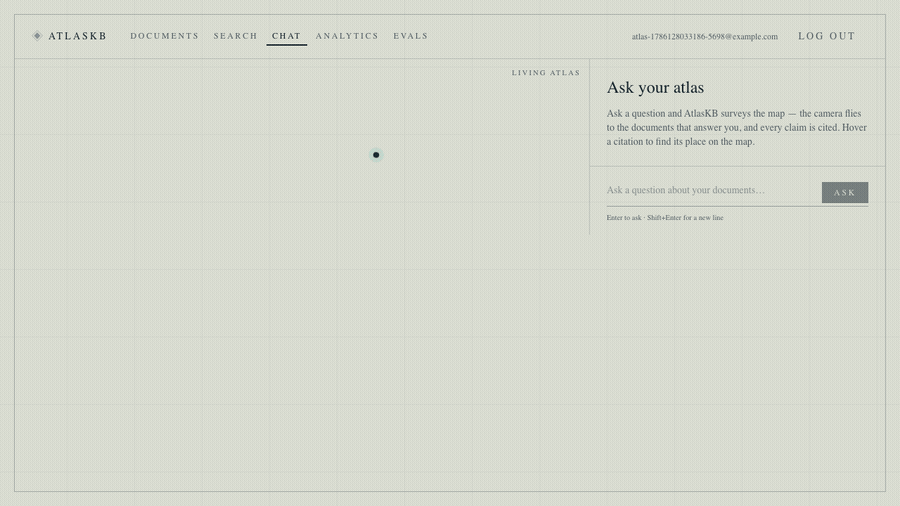

# AtlasKB

**AtlasKB is a multi-tenant, agentic RAG platform that answers questions from your
documents with real citations — and shows you *why*.** Teams upload documents into
isolated workspaces; a LangGraph agent plans retrieval over a hybrid
(dense + full-text) index, checks whether it has enough to answer, and returns a
grounded answer where every claim links back to the exact source chunk. A 3D
"Living Atlas" turns each answer into a map: the camera flies to the documents
that answered you and lights a route between them.

> **Demo.** No public instance is hosted — but the clip below is a real recording,
> and the whole stack runs locally in ~2 minutes (see [Quickstart](#quickstart)).



<sub>Ask → the retrieved document nodes light amber and draw threads to the answer point → the cited answer appears in the panel; hovering a citation highlights its node. Falls back to a 2D map under reduced-motion / low-power.</sub>

---

## What it does

- **Grounded Q&A with citations.** Answers are generated *only* from retrieved
  chunks; each claim maps to the chunk IDs that support it, and the agent refuses
  ("cannot answer from the available documents") rather than hallucinate.
- **Hybrid retrieval.** pgvector cosine similarity (dense) fused with Postgres
  full-text search (sparse/BM25-style) via Reciprocal Rank Fusion.
- **Agentic retrieval loop (LangGraph).** plan → retrieve → assess sufficiency →
  optionally re-query (hard-bounded) → generate. Re-querying is capped so cost
  can't run away.
- **Multi-tenancy + RBAC + per-document ACLs.** Every document, chunk, and
  conversation is tenant-scoped; documents can be restricted to specific users
  even within a tenant. Roles: viewer / editor / admin.
- **Semantic cache + rate limiting (Redis).** Repeated queries are served from
  cache (no model call); per-user and per-tenant fixed-window limits.
- **Programmatic access.** Scoped API keys usable on `/search` and `/chat`.
- **Living Atlas (React Three Fiber).** A retrieval-reactive 3D visualization
  with a fully-functional 2D fallback and reduced-motion support.
- **Admin surfaces.** `/admin/analytics` (live tenant counts, cache size) and
  `/admin/evals` (latest eval run).

## Architecture

```
   Browser (:3000)                 Next.js 14 · React · Tailwind · React-Three-Fiber
        │  JWT / X-API-Key (CORS)
        ▼
   FastAPI (:8000)   auth · RBAC/ACL · rate-limit · semantic cache
        │   /search  /chat  /documents  /workspaces  /api-keys  /admin/*
        ├───────────────┬──────────────────────┬─────────────────────────┐
        ▼               ▼                       ▼                         ▼
     Redis           Postgres 16            Celery worker            OpenRouter
  cache + limits   + pgvector           parse→chunk→embed→write    (generation only;
                   dense + FTS index    (sentence-transformers,     model configurable)
                                         local embeddings)
        ▲               │
        │               │  /chat agent (LangGraph):
        └── cache ◄──────┤   plan → retrieve (RBAC-scoped hybrid) → assess
                         │   → re-query (bounded) → generate → grounded citations
                         ▼
              answer + citations + token usage
```

Embeddings are produced locally (sentence-transformers) or via the OpenAI
embeddings API — **never** through OpenRouter (which doesn't serve embeddings).
Only answer *generation* uses OpenRouter, with a configurable model slug.

## Measured results

All numbers below are **measured on this project**, not estimates unless labelled.
Reproduce with `eval/run_eval.py` and `eval/load_test.py`.

### Retrieval & answer quality (`eval/run_eval.py`)

8-question labelled set over a 4-document corpus, generation model
`nvidia/nemotron-nano-9b-v2:free`:

| Metric | Result |
| --- | --- |
| Answer accuracy | **100%** (8/8) |
| Citation grounding (cited the right doc) | **100%** |
| Refusal accuracy (out-of-corpus → refuses) | **100%** |
| Retrieval hit rate (expected doc retrieved) | **100%** |
| Avg tokens / query | **~2,118** |

<sub>Small, curated set (N=8) — a smoke-grade quality gate, not a benchmark. The
`/admin/evals` page renders the latest run.</sub>

### Latency & throughput (`eval/load_test.py`, single API worker, rate-limiter off)

| Path | p50 | p95 | Throughput | Cache hit |
| --- | --- | --- | --- | --- |
| `/search` cold (cache miss) | **75 ms** | **101 ms** | 127 req/s | — |
| `/search` warm (cache hit) | **29 ms** | **49 ms** | **627 req/s** | 100% |
| `/chat` cold (agent + LLM) | **23.2 s** | **31.2 s** | — | — |
| `/chat` warm (cache hit) | **20 ms** | **45 ms** | **418 req/s** | 100% |

- **Retrieval is sub-100 ms** at p50/p95 (hybrid dense + FTS + RRF).
- **`/chat` cold latency is the external model**, not AtlasKB: the free-tier model
  is slow and the agent makes 2+ calls. The semantic cache turns a repeated
  question from **~23 s → ~20 ms (~1000×)** and **$0 model cost**.

### Cost per query

- **$0 measured** on the free-tier model; **$0** for any cache hit (no model call).
- At measured ~2,118 tokens/query, projected cost on paid small models is roughly
  **$0.003–0.006 / query** (e.g. Claude Haiku 4.5 / GPT-5.1 rates) — a projection,
  not billed.

## Tech stack

- **Backend:** Python 3.12, FastAPI, Pydantic v2, SQLAlchemy 2, Alembic,
  Postgres 16 + **pgvector**, Redis, Celery, **LangGraph**, OpenAI SDK (→ OpenRouter),
  sentence-transformers, argon2 + PyJWT, structlog.
- **Frontend:** Next.js 14 (App Router, TypeScript), Tailwind, **React Three Fiber
  / drei / three**, Playwright (e2e).
- **Tooling:** `uv` workspace (api + workers), Docker Compose (Postgres/Redis),
  ruff, pytest.

## Quickstart

Prerequisites: Docker, [`uv`](https://docs.astral.sh/uv/), Node 20+.

```bash
# 0. Install + configure (from the repo root)
uv sync --all-packages
cp .env.example .env         # set POSTGRES_PASSWORD, JWT_SECRET, OPENROUTER_API_KEY

# 1. Infra: Postgres+pgvector (host 15432) and Redis (host 6380)
docker compose up -d postgres redis

# 2. Database schema
set -a && . ./.env && set +a
(cd apps/api && uv run alembic upgrade head)

# 3. API  (terminal 1)
uv run uvicorn app.main:app --host 127.0.0.1 --port 8000 --reload

# 4. Worker  (terminal 2) — --pool=solo: PyTorch's Metal backend aborts in a forked worker on macOS
uv run celery -A atlaskb_workers.celery_app worker --loglevel=info --pool=solo

# 5. Web  (terminal 3)
cd apps/web && npm install && npm run dev      # http://localhost:3000
```

- Embeddings default to a local sentence-transformers model (no key; downloads on
  first use). `/chat` generation needs `OPENROUTER_API_KEY`; the model slug is
  configurable via `OPENROUTER_MODEL` (a `:free` slug works with no credits).
- Secrets are read from the environment / `.env` — the app refuses to boot if
  `DATABASE_URL` or `JWT_SECRET` is unset; no credential literals live in source.

## Tests, eval & load

```bash
# Backend unit + integration tests (real Postgres+pgvector, dedicated Redis DB)
cd apps/api && uv run pytest                     # 61 passing

# Frontend end-to-end (Playwright drives signup→upload→ask→cited answer, +atlas)
cd apps/web && npx playwright install chromium && npm run test:e2e

# Quality eval → writes eval/results/latest.json (served at /admin/evals)
uv run python eval/run_eval.py

# Load test → writes eval/results/load-latest.json
#   run the API with RATE_LIMIT_ENABLED=false so the limiter doesn't distort latency
uv run python eval/load_test.py
```

## API surface

| Method | Path | Auth | Purpose |
| --- | --- | --- | --- |
| POST | `/auth/signup` · `/auth/login` · `/auth/refresh` | — | JWT auth |
| POST/GET | `/workspaces`, `/workspaces/{id}/members`, `/workspaces/{id}/invite` | JWT | Tenants, members, roles |
| POST/GET/DELETE | `/api-keys` | JWT | Scoped programmatic keys |
| POST/GET | `/documents`, `/documents/{id}`, `/documents/{id}/acl` | JWT | Upload, list, detail, ACLs |
| POST | `/search` | JWT / API key | Raw hybrid retrieval (ranked chunks + scores) |
| POST | `/chat` | JWT / API key | Grounded answer + citations + token usage |
| GET | `/conversations`, `/conversations/{id}` | JWT | Conversation history |
| GET | `/admin/analytics`, `/admin/evals` | JWT (admin) | Tenant analytics, eval results |

Tenant is selected with the optional `X-Tenant-Id` header (defaults to the user's
personal workspace); `X-API-Key` authenticates programmatic calls.

## Repository layout

```
atlaskb/
  apps/
    web/       # Next.js 14 frontend (+ Living Atlas, Playwright e2e)
    api/       # FastAPI service (auth, RBAC, retrieval, agent, cache, admin)
    workers/   # Celery ingestion worker
  eval/        # eval + load-test harnesses, corpus, results/
  infra/docker # Dockerfiles
  docs/        # design plan + media
  docker-compose.yml
```

## Status

Feature-complete reference implementation: multi-tenant auth/RBAC/ACL, async
ingestion, hybrid retrieval, an agentic cited-answer pipeline, semantic cache +
rate limiting, API keys, the 3D Living Atlas with a 2D fallback, and admin
analytics/evals — all covered by automated tests and the measured results above.
