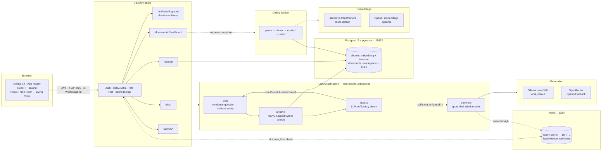
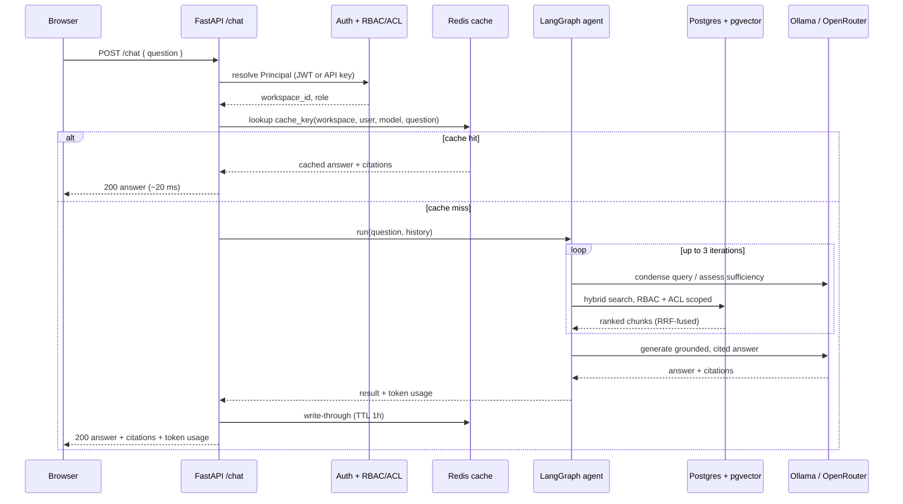

# AtlasKB

**AtlasKB is a multi-tenant, agentic RAG platform that answers questions from your
documents with real citations — and shows you *why*.** Teams upload documents into
isolated workspaces; a LangGraph agent plans retrieval over a hybrid
(dense + full-text) index, checks whether it has enough to answer, and returns a
grounded answer where every claim links back to the exact source chunk. A 3D
"Living Atlas" turns each answer into a map: the camera flies to the documents
that answered you and lights a route between them.

> **Demo.** No public instance is hosted — but the clip below is a real recording,
> and the whole stack runs locally in a few minutes (see [Quickstart](#quickstart)).


<sub>Ask → the retrieved document nodes light amber and draw threads to the answer point → the cited answer appears in the panel; hovering a citation highlights its node. Falls back to a 2D map under reduced-motion / low-power.</sub>

---

## What it does

- **Grounded Q&A with citations.** Answers are generated *only* from retrieved
  chunks; each claim maps to the chunk IDs that support it, and the agent refuses
  ("cannot answer from the available documents") rather than hallucinate.
- **Hybrid retrieval.** pgvector cosine similarity (dense) fused with Postgres
  full-text search (sparse/BM25-style) via Reciprocal Rank Fusion.
- **Agentic retrieval loop (LangGraph).** plan → retrieve → assess sufficiency →
  optionally re-query (hard-bounded at 3 iterations) → generate. Re-querying is
  capped so cost can't run away.
- **Local-first generation, no required API key.** Chat generation runs against a
  local **Ollama** model (`qwen3:8b`) by default — nothing to sign up for, no
  per-token bill. OpenRouter is available as an opt-in fallback
  (`LLM_PROVIDER=openrouter`) if you'd rather use a hosted model.
- **Local-first embeddings, too.** Chunk embeddings are produced in-process with
  **sentence-transformers** (no key, no network call); an OpenAI embeddings
  backend is available as an alternative.
- **Multi-tenancy + RBAC + per-document ACLs.** Every document, chunk, and
  conversation is scoped to a workspace; documents can be restricted to specific
  users or roles even within a workspace. Roles: viewer / editor / admin.
- **Query cache + rate limiting (Redis).** Repeated questions (same workspace,
  user, model, and — case/whitespace-insensitive — text) are served from cache
  with no model call; per-user and per-workspace fixed-window rate limits.
- **Programmatic access.** Scoped API keys usable on `/search` and `/chat`.
- **Living Atlas (React Three Fiber).** A retrieval-reactive 3D visualization —
  the chat panel's answer drives a live camera fly-through of the cited
  documents — with a fully-functional 2D fallback and reduced-motion support.
- **Admin surfaces.** `/admin/analytics` (live tenant counts, cache size),
  `/admin/content-gaps` (questions the corpus couldn't answer), and
  `/admin/evals` (latest eval run).

## Architecture



## How it works

**1. Sign up, get a workspace.** `POST /auth/signup` creates a user and a personal
workspace; every request after that is scoped to a workspace via the
`X-Workspace-Id` header (defaulted for you if omitted) or via a workspace-bound
API key sent as `X-API-Key`. Roles (`viewer` / `editor` / `admin`) gate write
routes; individual documents can further be restricted to specific users or
roles through a per-document ACL, enforced by a single choke-point query
(`document_visible_clause`) that every retrieval path — search, chat, listing —
goes through, so there's no code path that can accidentally leak a
tenant-scoped or ACL'd document.

**2. Upload a document, it gets ingested asynchronously.** `POST /documents`
stores the file and enqueues a Celery job. The worker runs one pipeline:
**parse → chunk → embed → write.** Parsing extracts text, chunking splits it
into retrieval-sized units, embedding batches the chunks (64 at a time) through
the configured embedding backend, and the write step deletes any previous
chunks for that document and inserts the new ones — so re-ingesting a document
is idempotent. The document's status flips to `ready` (or `failed`, with the
error captured) when the job finishes.

**3. Ask a question.** `POST /chat` hands the question to a LangGraph agent with
four nodes and one loop:

- **`plan`** — on the first pass, condenses the question (resolving "it" / "that
  policy" against conversation history) into a standalone retrieval query; on
  later passes, uses the refined query the assessment step produced.
- **`retrieve`** — runs hybrid search *scoped to the caller's workspace and ACL
  visibility*: pgvector cosine similarity (dense) and Postgres full-text search
  (sparse) each return candidates, which are merged with Reciprocal Rank Fusion
  (`1/(k+rank)`, `k=60`) into a single ranked list.
- **`assess`** — an LLM call judges whether the retrieved chunks are enough to
  answer the question. If not, and the loop hasn't hit its bound (3
  iterations), it proposes a refined query and the graph loops back to `plan`.
- **`generate`** — once sufficient (or the bound is hit — the agent always
  answers with what it has rather than looping forever), an LLM call produces
  the answer *and* a citation mapping from each claim to the chunk ID(s) that
  support it. If nothing relevant was retrieved, this step is what produces the
  explicit refusal instead of a guess.

Before any of that runs, `/chat` checks a Redis cache keyed on
`workspace · user · model · normalized(question)` — a repeat of the same
question (same tenant, same user, same model, case/whitespace-insensitive)
comes back with no model call at all. Every response — cached or not — carries
its citations and token usage back to the client.

**4. The answer becomes a map.** The frontend takes the cited chunks and feeds
them to the Living Atlas (`components/living-atlas/LivingAtlas.tsx`, React
Three Fiber): each cited document is a node in 3D space, the camera flies to
frame the ones that answered you, and a lit "thread" is drawn between them —
literally a route through the corpus, not just a list of links. Reduced-motion
or low-power sessions get `Atlas2DFallback`, an equivalent 2D projection with
no WebGL dependency. The same visual language (compass, terrain, thread field —
`components/atlas-world/`) recurs in smaller, decorative form across the
dashboard, search, onboarding, and auth screens, and the landing page's hero
(`components/landing/HeroSurveyScene.tsx`) is its own standalone survey-route
scene rather than a live query result.

### Request lifecycle for `/chat`



## Measured results

All numbers below are **measured on this project**, not estimates unless labelled.
Reproduce with `eval/run_eval.py` and `eval/load_test.py`. Both harnesses select
whichever `LLM_PROVIDER` the API is running with — the numbers below were
captured against OpenRouter's free tier for a reproducible, non-local baseline;
running the same harness against the default local Ollama model will shift
latency (no network round-trip, but a smaller local model) without changing the
retrieval-side numbers.

### Retrieval & answer quality (`eval/run_eval.py`)

8-question labelled set over a 4-document corpus, generation model
`nvidia/nemotron-nano-9b-v2:free`:

| Metric | Result |
| --- | --- |
| Answer accuracy | **100%** (8/8) |
| Citation grounding (cited the right doc) | **100%** |
| Refusal accuracy (out-of-corpus → refuses) | **100%** |
| Retrieval hit rate (expected doc retrieved) | **100%** |
| Avg tokens / query | **~2,118** |

<sub>Small, curated set (N=8) — a smoke-grade quality gate, not a benchmark. The
`/admin/evals` page renders the latest run.</sub>

### Latency & throughput (`eval/load_test.py`, single API worker, rate-limiter off)

| Path | p50 | p95 | Throughput | Cache hit |
| --- | --- | --- | --- | --- |
| `/search` cold (cache miss) | **75 ms** | **101 ms** | 127 req/s | — |
| `/search` warm (cache hit) | **29 ms** | **49 ms** | **627 req/s** | 100% |
| `/chat` cold (agent + LLM) | **23.2 s** | **31.2 s** | — | — |
| `/chat` warm (cache hit) | **20 ms** | **45 ms** | **418 req/s** | 100% |

- **Retrieval is sub-100 ms** at p50/p95 (hybrid dense + FTS + RRF).
- **`/chat` cold latency is dominated by the model call**, not AtlasKB: the
  free-tier hosted model measured above is slow and the agent can make several
  calls in one turn. The cache turns a repeated question from
  **~23 s → ~20 ms (~1000×)** and **$0 model cost**.

### Cost per query

- **$0** with the default local Ollama provider — no API calls leave the machine.
- **$0 measured** on the OpenRouter free-tier model used for the eval above;
  **$0** for any cache hit regardless of provider (no model call).
- At measured ~2,118 tokens/query, projected cost on paid small hosted models is
  roughly **$0.003–0.006 / query** (e.g. Claude Haiku 4.5 / GPT-5.1 rates) — a
  projection, not billed.

## Tech stack

- **Backend:** Python 3.12, FastAPI, Pydantic v2, SQLAlchemy 2, Alembic,
  Postgres 16 + **pgvector**, Redis, Celery, **LangGraph**, OpenAI-compatible
  client (→ local Ollama by default, OpenRouter optional), sentence-transformers,
  argon2 + PyJWT, structlog.
- **Frontend:** Next.js 14 (App Router, TypeScript), Tailwind, **React Three Fiber
  / drei / three**, Playwright (e2e).
- **Tooling:** `uv` workspace (api + workers), Docker Compose (Postgres/Redis),
  ruff, pytest.

## Quickstart

Prerequisites: Docker, [`uv`](https://docs.astral.sh/uv/), Node 20+,
[Ollama](https://ollama.com) (for the default local LLM — skip if you'll run
with `LLM_PROVIDER=openrouter` instead).

```bash
# 0. Install + configure (from the repo root)
uv sync --all-packages
cp .env.example .env         # set POSTGRES_PASSWORD, JWT_SECRET
                              # (only needed if you're using LLM_PROVIDER=openrouter: OPENROUTER_API_KEY)

# 0b. Pull the local model (skip if using OpenRouter instead)
ollama pull qwen3:8b
ollama serve                  # if not already running as a background service

# 1. Infra: Postgres+pgvector (host 15432) and Redis (host 6380)
docker compose up -d postgres redis

# 2. Database schema
set -a && . ./.env && set +a
(cd apps/api && uv run alembic upgrade head)

# 3. API  (terminal 1)
uv run uvicorn app.main:app --host 127.0.0.1 --port 8000 --reload

# 4. Worker  (terminal 2) — --pool=solo: PyTorch's Metal backend aborts in a forked worker on macOS
uv run celery -A atlaskb_workers.celery_app worker --loglevel=info --pool=solo

# 5. Web  (terminal 3)
cd apps/web && npm install && npm run dev      # http://localhost:3000
```

- Embeddings default to a local sentence-transformers model (no key; downloads
  on first use, `EMBEDDING_BACKEND=openai` is the alternative).
- `/chat` generation defaults to local Ollama (`qwen3:8b`, no key needed —
  `GET /health/llm` reports whether it's reachable and the model is pulled). Set
  `LLM_PROVIDER=openrouter` plus `OPENROUTER_API_KEY` to use a hosted model
  instead; `OPENROUTER_MODEL` picks the slug (a `:free` slug works with no
  credits).
- Secrets are read from the environment / `.env` — the app refuses to boot if
  `DATABASE_URL` or `JWT_SECRET` is unset; no credential literals live in source.

## Tests, eval & load

```bash
# Backend unit + integration tests (real Postgres+pgvector, dedicated Redis DB)
cd apps/api && uv run pytest                     # 60+ passing, across 12 files

# Frontend end-to-end (Playwright drives signup→upload→ask→cited answer, +atlas)
cd apps/web && npx playwright install chromium && npm run test:e2e

# Quality eval → writes eval/results/latest.json (served at /admin/evals)
uv run python eval/run_eval.py

# Load test → writes eval/results/load-latest.json
#   run the API with RATE_LIMIT_ENABLED=false so the limiter doesn't distort latency
uv run python eval/load_test.py
```

## API surface

| Method | Path | Auth | Purpose |
| --- | --- | --- | --- |
| POST | `/auth/signup` · `/auth/login` · `/auth/refresh` | — | JWT auth |
| POST/GET | `/workspaces`, `/workspaces/{id}/members`, `/workspaces/{id}/invites` | JWT | Workspaces, members, roles |
| GET/POST | `/invites/{token}`, `/invites/{token}/accept` | JWT | Accept a workspace invite |
| POST/GET/DELETE | `/api-keys` | JWT | Scoped programmatic keys |
| POST/GET | `/documents`, `/documents/{id}`, `/documents/{id}/access` | JWT | Upload, list, detail, per-document ACLs |
| POST | `/documents/{id}/verify` | JWT | Re-run/confirm ingestion status |
| GET | `/dashboard/relief` | JWT | Workspace-level summary data |
| POST | `/search` | JWT / API key | Raw hybrid retrieval (ranked chunks + scores) |
| POST | `/chat` | JWT / API key | Grounded answer + citations + token usage |
| GET | `/conversations`, `/conversations/{id}` | JWT | Conversation history |
| GET | `/admin/analytics`, `/admin/evals`, `/admin/content-gaps`, `/admin/query-volume` | JWT (admin) | Tenant analytics, eval results, unanswered questions |
| GET | `/health`, `/health/llm` | — | Liveness, LLM provider reachability |

The workspace is selected with the optional `X-Workspace-Id` header (defaults to
the user's personal workspace); `X-API-Key` authenticates programmatic calls and
carries its own fixed workspace and role.

## Repository layout

```
atlaskb/
  apps/
    web/       # Next.js 14 frontend (+ Living Atlas, Playwright e2e)
    api/       # FastAPI service (auth, RBAC, retrieval, agent, cache, admin)
    workers/   # Celery ingestion worker (calls into apps/api's ingest pipeline)
  eval/        # eval + load-test harnesses, corpus, results/
  infra/       # docker/ (Dockerfiles), k8s/, terraform/
  docs/        # design plan + media
  docker-compose.yml
```

## Status

Feature-complete reference implementation: multi-tenant auth/RBAC/ACL, async
ingestion, hybrid retrieval, an agentic cited-answer pipeline with local-first
generation and embeddings, a query cache + rate limiting, API keys, the 3D
Living Atlas with a 2D fallback, and admin analytics/evals/content-gap
surfaces — all covered by automated tests and the measured results above.
