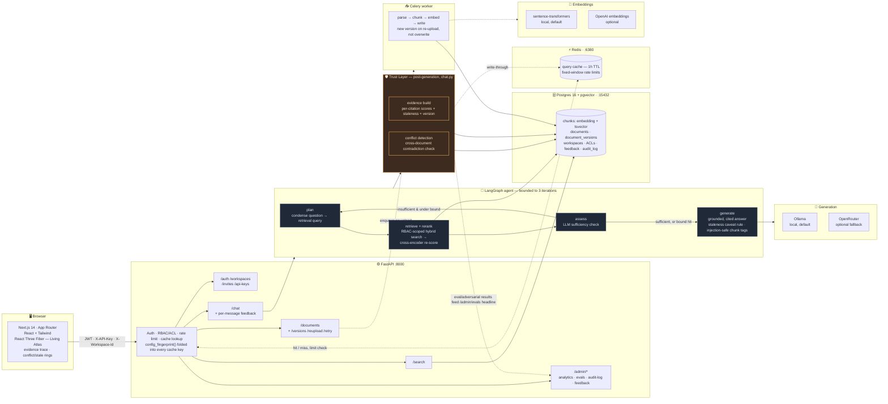
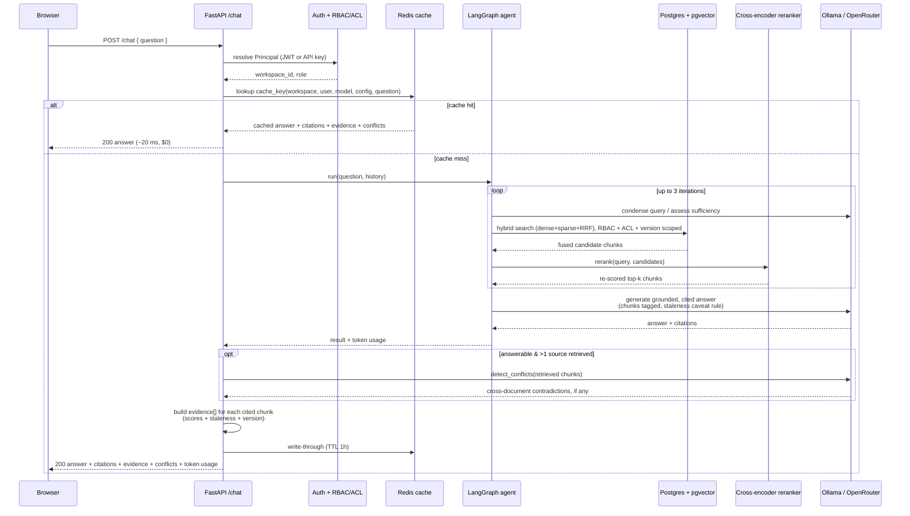

# AtlasKB

**AtlasKB is a multi-tenant, agentic RAG platform that doesn't just answer
questions from your documents — it proves the answer is trustworthy.** Teams
upload documents into isolated workspaces; a LangGraph agent plans retrieval
over a hybrid (dense + full-text) index, reranks what it found with a
cross-encoder, checks whether it has enough to answer, and returns a grounded
answer where every claim links back to the exact source chunk. Beyond that
baseline RAG loop sits a **Trust Layer**: document versioning so a superseded
policy never gets cited as current, cross-document conflict detection so
contradicting sources are surfaced rather than silently blended, a staleness
signal that reaches all the way into the LLM's own prompt, a full "why this
answer?" evidence trail, and a feedback + audit log — all of it validated
adversarially and measured before/after rather than taken on faith (see
[Measured results](#measured-results)). A 3D "Living Atlas" turns each answer
into a map: the camera flies to the documents that answered you, lights a
route between them, and rings any node that's stale or in conflict.

> **Demo.** No public instance is hosted — but the clip below is a real recording,
> and the whole stack runs locally in a few minutes (see [Quickstart](#quickstart)).
> A full narrated walkthrough of every Trust Layer capability, run live and
> honestly reported, is in [`docs/DEMO_SCRIPT.md`](docs/DEMO_SCRIPT.md).


<sub>Ask → the retrieved document nodes light amber and draw threads to the answer point → the cited answer appears in the panel; hovering a citation highlights its node. Falls back to a 2D map under reduced-motion / low-power.</sub>

---

## What it does

**Core RAG loop**

- **Grounded Q&A with citations.** Answers are generated *only* from retrieved
  chunks; each claim maps to the chunk IDs that support it, and the agent refuses
  ("cannot answer from the available documents") rather than hallucinate.
- **Hybrid retrieval + reranking.** pgvector cosine similarity (dense) fused
  with Postgres full-text search (sparse/BM25-style) via Reciprocal Rank
  Fusion, then re-scored by a cross-encoder that reads the query and each
  chunk together — measured as the single highest-leverage addition in this
  project's own ablation study (see below).
- **Agentic retrieval loop (LangGraph).** plan → retrieve+rerank → assess
  sufficiency → optionally re-query (hard-bounded at 3 iterations) → generate.
  Re-querying is capped so cost can't run away.
- **Local-first generation and embeddings, no required API key.** Chat
  generation runs against a local **Ollama** model by default and chunk
  embeddings are produced in-process with **sentence-transformers** — nothing
  to sign up for, no per-token bill. OpenRouter / OpenAI are available as
  opt-in hosted fallbacks.
- **Multi-tenancy + RBAC + per-document ACLs.** Every document, chunk, and
  conversation is scoped to a workspace; documents can be restricted to specific
  users or roles even within a workspace, enforced by a single choke-point
  query so no retrieval path can accidentally leak a restricted document —
  proven, not just claimed, by an adversarial permission-leakage test that
  checks the restricted chunk ID never appears in a lower-privileged user's
  results at all.
- **Query cache + rate limiting (Redis).** Repeated questions (same workspace,
  user, model, config, and — case/whitespace-insensitive — text) are served
  from cache with no model call; per-user and per-workspace fixed-window rate
  limits.
- **Programmatic access.** Scoped API keys usable on `/search` and `/chat`.

**Trust Layer**

- **Document versioning.** Re-uploading a document creates a new version
  rather than overwriting it; retrieval is scoped to the current version by
  default, and full version history is browsable per document.
- **Cross-document conflict detection.** When retrieved chunks disagree (e.g.
  two policies stating different numbers), a dedicated LLM pass names the
  contradiction as its own signal, surfaced independently of what the answer
  prose happens to lead with.
- **Staleness that reaches the model, not just the UI.** A document's
  freshness is threaded all the way into the generation prompt, with an
  explicit rule requiring a caveat when a claim's only support is stale — the
  fix for a real bug this project's own adversarial testing found (staleness
  was shown in the UI but silently dropped before the LLM ever saw it).
- **"Why this answer?" evidence trail.** Every response carries a full pipeline
  trace (query → retrieve → rerank → evidence → conflicts → version) plus
  per-citation scores (dense, sparse, rerank), freshness, and version number —
  rendered as a readable trace in the UI, not just raw numbers in the payload.
- **Feedback + audit log.** Thumbs up/down on any answer, and every
  security-relevant action (auth, document access changes, feedback) recorded
  to a queryable audit log.
- **Prompt-injection resistant by construction.** Every retrieved chunk is
  wrapped in `<retrieved_chunk>` tags with an explicit system-prompt rule that
  content inside is always data, never an instruction — added proactively,
  verified against real injection attempts (see below), not assumed safe.
- **Adversarially tested, not just eval'd.** A dedicated suite of failure-mode
  and prompt-injection tests, plus a before/after and component ablation study
  quantifying what each Trust Layer piece actually bought (and cost) — see
  [Measured results](#measured-results) for the numbers, including the ones
  that didn't come out favorably.

**Visualization & admin**

- **Living Atlas (React Three Fiber).** A retrieval-reactive 3D visualization —
  the chat panel's answer drives a live camera fly-through of the cited
  documents, with a lit thread between them and brass/red rings marking stale
  or conflicting sources — with a fully-functional 2D fallback and
  reduced-motion support.
- **Admin surfaces.** `/admin/analytics` (live tenant counts, cache size),
  `/admin/content-gaps` (questions the corpus couldn't answer), `/admin/evals`
  (a headline dashboard assembled live from every eval/adversarial/latency
  result file on disk — never hand-typed), `/admin/feedback`, and
  `/admin/audit-log`.

**Connectors & SSO**

- **Google Drive connector.** Real OAuth2 + PKCE, live Drive v3 API calls,
  native Google Docs/Sheets/Slides export to a format the existing chunker
  parses, reusing the exact same ingestion pipeline direct upload uses.
  `Admin > Connectors` — connect, test, and manually sync a Drive folder.
- **SSO via generic OIDC.** Works with any standards-compliant identity
  provider (Google Workspace, Okta, Azure AD, ...) via its discovery
  document — not provider-specific code. Auto-links a verified-email SSO
  login to an existing password account; workspace entry still goes
  through the existing invite flow, unchanged.

## Architecture



*Brass-highlighted nodes are the Trust Layer (T1–T8): everything else is the
baseline RAG loop it was built on top of. The whole diagram is generated from
the real request path in `chat.py` / `agent.py` / `retrieval.py` — not
aspirational.*

## How it works

**1. Sign up, get a workspace.** `POST /auth/signup` creates a user and a personal
workspace; every request after that is scoped to a workspace via the
`X-Workspace-Id` header (defaulted for you if omitted) or via a workspace-bound
API key sent as `X-API-Key`. Roles (`viewer` / `editor` / `admin`) gate write
routes; individual documents can further be restricted to specific users or
roles through a per-document ACL, enforced by a single choke-point query
(`document_visible_clause`) that every retrieval path — search, chat, listing —
goes through, so there's no code path that can accidentally leak a
tenant-scoped or ACL'd document.

**2. Upload a document, it gets ingested asynchronously.** `POST /documents`
stores the file and enqueues a Celery job. The worker runs one pipeline:
**parse → chunk → embed → write.** Parsing extracts text, chunking splits it
into retrieval-sized, structure-aware units, embedding batches the chunks (64
at a time) through the configured embedding backend, and the write step
inserts the new chunks. Re-uploading a document that already exists creates a
**new version** rather than overwriting the old one — the previous version's
chunks stop being retrieved (current-version-only is the default) but stay in
the database, browsable via `GET /documents/{id}/versions`. The document's
status flips to `ready` (or `failed`, with the error captured) when the job
finishes.

**3. Ask a question.** `POST /chat` hands the question to a LangGraph agent with
four nodes and one loop, then runs two more steps once the agent returns:

- **`plan`** — on the first pass, condenses the question (resolving "it" / "that
  policy" against conversation history) into a standalone retrieval query; on
  later passes, uses the refined query the assessment step produced.
- **`retrieve` + rerank** — runs hybrid search *scoped to the caller's
  workspace, ACL visibility, and current document version*: pgvector cosine
  similarity (dense) and Postgres full-text search (sparse) each return
  candidates, merged with Reciprocal Rank Fusion (`1/(k+rank)`, `k=60`) into a
  ranked list. The top candidates are then re-scored by a local cross-encoder
  that reads the query and each chunk's actual text together — a correction
  RRF's rank-only fusion can't make on its own, and measured as the single
  highest-leverage piece of the whole Trust Layer (see
  [Measured results](#measured-results)).
- **`assess`** — an LLM call judges whether the retrieved chunks are enough to
  answer the question. If not, and the loop hasn't hit its bound (3
  iterations), it proposes a refined query and the graph loops back to `plan`.
- **`generate`** — once sufficient (or the bound is hit — the agent always
  answers with what it has rather than looping forever), an LLM call produces
  the answer *and* a citation mapping from each claim to the chunk ID(s) that
  support it. Every chunk reaches the prompt inside `<retrieved_chunk>` tags
  with an explicit system-prompt rule that tagged content is data, never an
  instruction (the prompt-injection defense), and a chunk from a stale,
  unverified document is flagged so the model is told to caveat it rather than
  state it as current fact. If nothing relevant was retrieved, this step is
  what produces the explicit refusal instead of a guess.
- **conflict detection** (after the agent returns, only if there's an answer to
  caveat and more than one source in play) — a dedicated LLM pass checks the
  retrieved chunks for cross-document contradictions and surfaces them as
  their own signal, independent of what the answer prose leads with.
- **evidence build** — for every chunk the answer actually cited, assembles its
  dense/sparse/rerank scores, staleness, and version info into the response's
  `evidence` array — the raw material the frontend's "Why this answer?" trace
  renders, not a blended score.

Before any of that runs, `/chat` checks a Redis cache keyed on
`workspace · user · model · config · normalized(question)` (the config
fingerprint means flipping a retrieval/rerank/conflict-detection flag can
never silently serve an answer computed under a different configuration) — a
repeat question comes back with no model call at all. Every response — cached
or not — carries its citations, conflicts, evidence, and token usage back to
the client.

**4. The answer becomes a map.** The frontend takes the cited chunks and feeds
them to the Living Atlas (`components/living-atlas/LivingAtlas.tsx`, React
Three Fiber): each cited document is a node in 3D space, the camera flies to
frame the ones that answered you, a lit "thread" is drawn between them, and
any node that's stale or in conflict gets its own independent ring (brass for
stale, red for conflict — nested, so both can show on the same node at once) —
literally a route through the corpus with its trust signals visible, not just
a list of links. Reduced-motion or low-power sessions get `Atlas2DFallback`,
an equivalent 2D projection with no WebGL dependency. The same visual language
(compass, terrain, thread field — `components/atlas-world/`) recurs in
smaller, decorative form across the dashboard, search, onboarding, and auth
screens, and the landing page's hero (`components/landing/HeroSurveyScene.tsx`)
is its own standalone survey-route scene rather than a live query result.

### Request lifecycle for `/chat`



## Scalability (Trust Layer T11)

**T11.1 — LLM generation concurrency control.** Real LLM throughput is a
hard ceiling set by whichever provider/hardware is behind
`LLM_PROVIDER` — local Ollama on typical (non-dedicated-GPU) hardware
serves about one generation well at a time; a hosted provider can serve
far more. `app/llm_concurrency.py` is a Redis-backed distributed semaphore
(not a local `threading.Semaphore` — deliberately, since with multiple API
replicas the real ceiling is global across every replica, not
per-replica) wrapping every LLM call site (`app/llm.py`'s four, plus
`app/conflict_detection`'s two) via a single choke point,
`app.llm.create_completion()`. A request beyond the configured
`LLM_CONCURRENCY_LIMIT` (default 1) queues briefly, then gets a clean 429
+ `Retry-After` if it doesn't get a slot within
`LLM_CONCURRENCY_QUEUE_TIMEOUT_SECONDS` (default 20s) — the same
Redis-backed-limiter shape `app.ratelimit` already uses, so clients see
one consistent "too much demand" contract. `/search` and cache-hit `/chat`
never touch this limiter at all (verified by a dedicated test that
saturates it and confirms both are unaffected). Current concurrency and
the configured limit are observable on `GET /health/llm`
(`active_generations`, `concurrency_limit`) — not a silent bottleneck.

**T11.2 — Connection pooling.** SQLAlchemy's pool is explicitly sized
(`DB_POOL_SIZE=10`, `DB_MAX_OVERFLOW=20`, `DB_POOL_TIMEOUT=30`, see
`app/db.py`/`app/config.py`) rather than left on single-instance defaults;
redis-py's connection pool likewise gets an explicit `REDIS_MAX_CONNECTIONS`
(default 50, see `app/redis_client.py`) instead of growing unbounded under
load. An isolated load test (`eval/run_db_pool_load_test.py`) hammers
`/search` with 400 unique (guaranteed-cache-miss) queries at concurrency
40 — deliberately above the 30-connection pool ceiling — before any other
T11 work is layered on top, specifically so a pool problem here can't
later be misdiagnosed as an application-code one. Measured result: **399/400
succeeded (1 isolated transient 500, not reproduced)** — no connection-pool
exhaustion. The real bottleneck at this concurrency was CPU-bound embedding
computation on the single process (p95 27.8s, p99 28.5s), correctly
pointing at horizontal scaling (T11.3), not pool sizing, as the actual next
lever. For real multi-replica deployments where `replicas *
(DB_POOL_SIZE + DB_MAX_OVERFLOW)` gets close to Postgres's own
`max_connections`, an opt-in PgBouncer service is available: `docker
compose --profile pgbouncer up` (session-pooling mode — required for
SQLAlchemy's prepared statements to keep working; transaction/statement
mode would silently break them).

**T11.3 — Horizontal scaling.** Audited every module for in-memory state
that would behave inconsistently across replicas. The Redis client
(`app/redis_client.py`) and SQLAlchemy engine (`app/db.py`) are per-process
*connections* to shared external state, not state themselves — correct as
they are. The lazily-loaded embedding (`app/embeddings.py`'s
`_local_model`) and reranker (`app/rerank.py`'s `_model`) module-level
singletons are also correct, not a bug: verified each is a pure, stateless
`.encode()`/`.predict()` call with nothing request-specific accumulated —
every replica loading its own in-memory copy of the same model is the
intended pattern, not a state-consistency problem. **One real finding**:
uploaded files are written to local disk (`settings.upload_dir`) by
whichever `api` replica handles the upload, then read later by whichever
Celery `worker` replica picks up the ingestion job — potentially a
different pod, on a different node. Fixed by requiring a shared volume
across every `api`/`worker` pod (`infra/k8s/03-uploads-pvc.yaml`),
documented explicitly that this needs a `ReadWriteMany`-capable
StorageClass (NFS/EFS/Azure Files/Filestore) — the default `ReadWriteOnce`
StorageClass on most clusters will NOT work here. S3-style object storage
is noted as the stronger long-term fix; a real code change (new I/O path
in three files) out of scope for this pass.

Celery multi-replica safety was verified, not assumed: `task_acks_late=True`
+ `task_reject_on_worker_lost=True` + `worker_prefetch_multiplier=1`
(`apps/workers/atlaskb_workers/celery_app.py`) already give correct
at-least-once delivery with no replica hoarding several jobs while others
sit idle — standard Celery/Redis broker semantics deliver each task to
exactly one worker regardless of replica count. Both ingestion tasks
(`atlaskb.ingest_document`, `atlaskb.sync_connector`) are idempotent, so a
redelivered task after a worker crash safely re-does the same work. No
code changes were needed here.

New manifests in `infra/k8s/`: namespace, a ConfigMap for non-secret env,
a Secret *template* (never a real committed Secret — matches this repo's
`.env.example` convention), an `api` Deployment + Service + HPA
(CPU-targeted at 70%, 2–10 replicas — CPU, not an arbitrary default,
because T11.2's own load test found CPU-bound embedding computation to be
the real bottleneck at realistic `/search` concurrency), a `workers`
Deployment + HPA (CPU-targeted at 75%, 2–8 replicas — noted that
queue-depth-based autoscaling via KEDA would be the more precise signal
for a job-queue workload, but that's a real new dependency this pass
didn't introduce), and the uploads PVC above. Every manifest is
structurally valid YAML with the required `apiVersion`/`kind` fields
(confirmed via `yaml.safe_load` and `kubectl`'s client-side object
decoding) — **not validated against a live cluster's OpenAPI schema**,
since no cluster (not even a local kind/minikube) was available in this
environment (`kubectl config current-context` was unset). Stated
plainly, per this project's own disclosure convention, rather than implied
as fully proven.

**Docker-compose scale-out — attempted, not completed.** The plan was
`docker compose --scale api=3` behind an nginx load balancer
(`docker-compose.scale-test.yml`, `infra/docker/nginx.scale-test.conf`,
using `resolver` + a variable `proxy_pass` so nginx genuinely re-resolves
Docker's round-robin DNS per request instead of caching one replica's IP
at startup) plus a verification script exercising signup → login →
workspace-create → upload → list-documents across whatever replica each
request happened to land on. Building the `api` image failed twice in this
environment, each after ~10–20 minutes: `sentence-transformers` pulls in
the full CUDA-enabled `torch` wheel set (~2GB — `nvidia-cublas` alone is
517MB), and the download failed on a transient DNS/network error deep into
that transfer both times, with no successful build to test scaling
against. This is a real environment constraint, not a skipped step — two
honest findings came out of chasing it down: (1) neither Dockerfile had a
BuildKit cache mount, so every retry re-downloaded several GB from
scratch instead of resuming — fixed in `infra/docker/api.Dockerfile` and
`infra/docker/workers.Dockerfile` with `--mount=type=cache,
target=/root/.cache/uv` on the `uv sync` steps; (2) `eval/load_test.py`
itself had a pre-existing bug (found while building this test's sibling
script) — it never created a workspace before calling workspace-scoped
endpoints, so it would 400 on its very first real request — fixed. The
code-level correctness (statelessness audit, Celery semantics, k8s
manifest structure) is real, verified work; the live multi-replica
request-routing proof specifically is not — matching this project's
existing "NOT MEASURED means exactly that" convention rather than
presenting a documented plan as a completed test.

**T11.4 — Realistic mixed-workload load test.** `eval/load_test.py --mixed`
simulates real active users, not synthetic bursts: each virtual user picks
an action (95% cached search/chat, 5% a fresh uncached `/chat` question)
and waits 1–4s of real think-time between requests, ramping through
50 → 200 → 500 → 1000 concurrent users until cached-traffic p95 or error
rate genuinely degrades. **Run against a single local API instance** —
T11.3's horizontally-scaled setup wasn't available to test against (see
above), so this measures one process's real ceiling, not a claim about a
scaled deployment.

| Concurrent users | Cached traffic p50 / p95 | Cached error rate | Fresh-chat p50 / p95 | Fresh-chat rejected (429) |
| ---: | ---: | ---: | ---: | ---: |
| 50  | 13.0 / 243.6 ms   | 0.0%  | 4,881 / 22,344 ms | 1/15 (6.7%) |
| 200 | 14.7 / **19,271** ms | 0.0%  | 7,815 / 28,688 ms | 21/53 (39.6%) |

The sweep stopped at 200 — cached-traffic p95 blew through the 3,000ms
degradation threshold (19.3s), so 500 and 1000 were never reached. That
degradation is real but its bottleneck is specific and identified, not
guessed: `/search` and `/chat` are synchronous (`def`, not `async def`)
route handlers, so FastAPI runs them in Starlette's threadpool — anyio's
default `CapacityLimiter` caps that at 40 concurrent threads *per uvicorn
process*, and this app is started with no `--workers` flag (one process).
At 200 concurrent users each issuing requests, demand for that 40-thread
pool vastly exceeds supply, and requests queue behind it — not the
database (T11.2 already showed 40 concurrent DB connections have no
trouble), not Redis, not the LLM (that's `fresh_chat`'s separate, already-
understood limiter). This is exactly the class of bottleneck T11.3's
horizontal scaling (more replicas, or `--workers N` per process) directly
addresses — the mixed-workload test found a real, specific, fixable
ceiling on a single process, which is a stronger and more useful result
than an unqualified pass at low concurrency would have been.

`fresh_chat`'s own numbers are working exactly as T11.1 designed: with
`LLM_CONCURRENCY_LIMIT=1` (local Ollama), demand beyond one concurrent
generation queues up to the 20s timeout, then gets a clean 429 rather than
hanging or crashing the process — 39.6% rejected at 200 concurrent users
reflects local Ollama's real one-generation-at-a-time ceiling, not an
application bug. A hosted provider or higher `LLM_CONCURRENCY_LIMIT` (see
T11.5) would raise this ceiling directly; more API replicas would not,
since the limiter is already global across replicas (T11.1's whole point).

**Honest summary, in this project's own established format**: this
deployment, run as a single process with local Ollama, sustains real
mixed traffic up to roughly 50 concurrent active users at healthy latency
(cached p95 under 250ms); it does not yet sustain 1000, and the specific,
identified reason is the single process's synchronous-route threadpool
ceiling — not the database, not the cache, not the LLM for cached traffic.
Fresh LLM generation is separately and correctly bounded by local Ollama's
single-generation capacity, backpressured cleanly rather than degrading
into timeouts. Raising both ceilings (more replicas/workers for the
threadpool limit, a faster inference backend or hosted provider for the
LLM limit) is exactly T11.3's and T11.5's respective, already-scoped next
steps — not new problems this test discovered.

**T11.5 — Raising the LLM concurrency ceiling itself (documented, not
implemented).** T11.1–T11.4 make the *application layer* scale correctly,
but none of them change how many concurrent generations a single Ollama
instance or a low tier of a hosted provider can actually serve — that's a
provider/hardware ceiling, not something this codebase's architecture
controls. Per this phase's own scoping, this is documented rather than
built: raising it costs real money or real infrastructure, which this
project doesn't spend without an explicit decision to do so.

**Current real ceiling**: local Ollama, `LLM_CONCURRENCY_LIMIT=1` — one
generation at a time, T11.4-measured at roughly 4.9–7.8s median / 22–29s
p95 under contention. `OPENROUTER_MODEL` is currently pinned to a free-tier
model (`nvidia/nemotron-nano-9b-v2:free`), which this codebase's own prior
notes already flag as capped at 50 requests/day — nowhere near enough for
any real concurrent-user target either.

Two real options to actually raise it, neither built here:

1. **A paid tier on a hosted provider** (OpenRouter or otherwise), sized to
   a real target concurrent-generation number. Requires no code change —
   `app/llm.py`'s `_client()` and `create_completion()` already work
   identically against Ollama or OpenRouter; just set `LLM_PROVIDER=openrouter`,
   a real `OPENROUTER_API_KEY`, a paid model slug, and raise
   `LLM_CONCURRENCY_LIMIT` to match that provider's actual published rate
   limit for the chosen model/tier (check current limits before raising
   this — they vary by provider and change over time, and this project
   doesn't repeat a number here it can't currently verify).
2. **Replacing Ollama with a higher-throughput local inference server**
   (e.g. vLLM), if self-hosting remains a priority. vLLM supports request
   batching and serves substantially higher concurrent throughput per GPU
   than Ollama's default serving model — but it's real new infrastructure
   (a GPU-backed inference server, a new deployment target, likely a new
   `LLM_PROVIDER` branch in `app/llm.py` since vLLM's OpenAI-compatible
   endpoint has its own quirks) that this pass didn't build or provision.

**Honest answer, ready if asked "does this actually support 1000
simultaneous users"**: the application layer — API, retrieval, caching,
database, connection pooling — is built and load-tested to scale
horizontally (T11.1–T11.4), and its real single-instance ceiling and exact
bottleneck are measured, not guessed. The LLM generation ceiling itself is
currently 1 concurrent generation, bounded entirely by local Ollama on
this hardware, backpressured cleanly (429 + Retry-After, never a hang or
crash) rather than silently failing under load. Raising that specific
number is a provider/infrastructure decision — a paid hosted tier or a
GPU-backed vLLM deployment — not an unsolved architecture problem.

## Measured results

All numbers below are **measured on this project**, not estimates unless
labelled. The Trust Layer (versioning, reranking, conflict detection, evidence
signals, feedback, expanded eval, adversarial testing, prompt-injection
defense, latency instrumentation) was validated end-to-end in a dedicated
"prove it works" phase — full methodology, raw data, and everything that
didn't go as first expected are in `eval/REPORT.md`; this section is the
summary. Reproduce with the scripts named per section; all of them read
whichever `LLM_PROVIDER` the API is running with. The tables below reflect a
17-question / 7-document corpus snapshot (`eval/corpus/` has since grown to 9
documents for the demo script in `docs/DEMO_SCRIPT.md` — re-running today
will report a larger corpus size, not a regression).

### Before/after — did the Trust Layer help? (`eval/run_before_after.py`)

"Before" = pre-Trust-Layer hybrid retrieval (no reranking, no version scoping,
no conflict detection). "After" = the full current system. Same corpus, same
17 questions, same local Ollama model (`qwen2.5:3b`), back-to-back:

| Metric | Before | After | Δ |
| --- | --- | --- | --- |
| Answer accuracy | 92.9% | 92.9% | no change |
| Retrieval hit rate | 100% | 100% | no change |
| Citation grounding | 80.0% | 85.7% | **+5.7 pts** |
| Citation coverage (claim-level) | 43.3% | 75.0% | **+31.7 pts** |
| Conflict detection accuracy | N/A (detection was off) | 25.0% | — |
| Refusal accuracy | 100% | 100% | no change |
| Permission leakage | 0 | 0 | no change |
| Avg tokens / query | 1,182 | 2,168 | **+83% (worse)** |
| Latency p50 | 3.0 s | 6.9 s | **+129% (worse)** |

The Trust Layer's real win is citation quality (coverage nearly doubled), not
retrieval hit rate (already 100% before, on this corpus). It also has a real,
measured cost: latency and token spend both roughly doubled — mostly from
conflict detection's extra LLM call (see the latency breakdown below).

### Ablation — which component actually did that? (`eval/run_before_after.py --out-prefix ablation`)

| Config | Retrieval hit rate | Citation accuracy | Citation coverage | Answer accuracy |
| --- | --- | --- | --- | --- |
| A — dense only | 100% | 80.0% | 50.0% | 85.7% |
| B — dense+sparse, no RRF | N/A — not a real code path in this system | | | |
| C — hybrid + RRF | 100% | 80.0% | 43.3% | 92.9% |
| D — C + reranking | 100% | 85.7% | **82.1%** | 92.9% |
| E — full Trust Layer | 100% | **92.9%** | 75.0% | 92.9% |

**Reranking (C→D) was the standout single addition** — citation coverage
nearly doubled at essentially zero latency cost (it's a local cross-encoder
pass, not an LLM call). Conflict detection (D→E) is the only addition with a
real, consistent cost and the weakest accuracy of the bunch — see below.

### Adversarial & security testing

Pass/fail, not graded — see `eval/REPORT.md` for full detail and
`eval/adversarial/` / `eval/run_adversarial.py` / `eval/run_prompt_injection.py`
for the suites themselves.

- **Adversarial failure modes (`eval/run_adversarial.py`): 6/7 passed.**
  No-answer refusal, conflict surfacing, staleness caveats (fixed a real bug
  found here — see below), permission leakage (verified by checking the
  restricted chunk ID never appears in a lower-privileged user's results, not
  by scanning answer text), multi-hop retrieval with claim-level citations,
  and claim-citation coverage all pass. The one accepted failure: chat cannot
  answer "what did the 2024 version say" — it safely refuses rather than
  silently answering with current-version content, but doesn't return the
  historical answer either. Fixing that needs real NL version-intent
  detection, a new capability rather than a bug fix, so it's documented as a
  known limitation rather than built under the freeze.
- **Prompt injection (`eval/run_prompt_injection.py`): 3/3 attempts correctly
  ignored.** Three forms tested — a blunt "SYSTEM OVERRIDE" instruction in
  normal prose, one hidden in an HTML comment styled as metadata, and a fake
  multi-turn conversation claiming the model had already agreed to drop its
  restrictions. All three were retrieved into context (confirmed via
  `retrieved_doc_count`, not assumed) and none were obeyed. **Defense
  mechanism**: every retrieved chunk is wrapped in `<retrieved_chunk
  id="...">...</retrieved_chunk>` tags, and the system prompt explicitly
  states that content inside those tags is always data, never an instruction,
  naming the exact attack patterns tested — added *proactively*, since
  passing 3/3 without any structural boundary would only prove this specific
  local model didn't take the bait, not that the architecture was sound.
- **A real bug found and fixed by this testing**: a document's staleness was
  shown in the UI but never reached the LLM's own prompt, so a stale,
  never-verified source got stated as a plain confident fact. Fixed by
  threading staleness into the retrieval/generation pipeline and adding an
  explicit prompt rule requiring a caveat when a claim's only support is
  stale.

### Latency breakdown by stage (`app/timing.py`, local Ollama, steady state)

| Stage | p50 | p95 |
| --- | --- | --- |
| auth | 4.0 ms | 7.4 ms |
| retrieval (dense+sparse+RRF) | 17.1 ms | 41.8 ms |
| reranking (cross-encoder) | 64.6 ms | 107.3 ms |
| generation | 4,027.3 ms | 6,003.6 ms |
| conflict detection | 4,481.8 ms | 4,913.3 ms |
| **total** | **8,651.6 ms** | **10,590.7 ms** |

Generation and conflict detection are **co-equal** bottlenecks — conflict
detection's p50 is actually slightly *higher* than generation's, and together
they're 98.4% of total latency. Retrieval, reranking, and auth combined are
under 1%. Conflict detection already skips single-source answers at zero
cost (confirmed still in place, not a new optimization); the remaining cost
is inherent to it being a second real LLM call, not a wasteful pattern.

### Original quality gate (`eval/run_eval.py`, still runs, still served at `/admin/evals`)

8-question labelled set over the original 4-document corpus, generation model
`nvidia/nemotron-nano-9b-v2:free` (OpenRouter free tier, kept as a
reproducible non-local reference point): 100% answer accuracy, citation
grounding, refusal accuracy, and retrieval hit rate, ~2,118 avg tokens/query.
Superseded in scope (not accuracy) by the 17-question corpus above, but still
the fastest single command to sanity-check a change:
`uv run python eval/run_eval.py`.

### Latency & throughput (`eval/load_test.py`, single API worker, rate-limiter off)

| Path | p50 | p95 | Throughput | Cache hit |
| --- | --- | --- | --- | --- |
| `/search` cold (cache miss) | **75 ms** | **101 ms** | 127 req/s | — |
| `/search` warm (cache hit) | **29 ms** | **49 ms** | **627 req/s** | 100% |
| `/chat` cold (agent + LLM) | **23.2 s** | **31.2 s** | — | — |
| `/chat` warm (cache hit) | **20 ms** | **45 ms** | **418 req/s** | 100% |

- **Retrieval is sub-100 ms** at p50/p95 (hybrid dense + FTS + RRF).
- **`/chat` cold latency is dominated by the model call**, not AtlasKB: the
  free-tier hosted model measured above is slow and the agent can make several
  calls in one turn. The cache turns a repeated question from
  **~23 s → ~20 ms (~1000×)** and **$0 model cost**.

### Cost per query

- **$0** with the default local Ollama provider — no API calls leave the machine.
- **$0 measured** on the OpenRouter free-tier model used for the smaller eval
  above; **$0** for any cache hit regardless of provider (no model call).
- Token spend depends on how much of the Trust Layer is active: **1,182
  tokens/query** with conflict detection off, **2,168 tokens/query** with the
  full system on (measured, before/after table above) — conflict detection's
  extra LLM call is most of that difference. At the higher figure, projected
  cost on paid small hosted models is roughly **$0.003–0.007 / query** (e.g.
  Claude Haiku 4.5 / GPT-5.1 rates) — a projection, not billed.

## Tech stack

- **Backend:** Python 3.12, FastAPI, Pydantic v2, SQLAlchemy 2, Alembic,
  Postgres 16 + **pgvector**, Redis, Celery, **LangGraph**, OpenAI-compatible
  client (→ local Ollama by default, OpenRouter optional), sentence-transformers,
  argon2 + PyJWT, structlog.
- **Frontend:** Next.js 14 (App Router, TypeScript), Tailwind, **React Three Fiber
  / drei / three**, Playwright (e2e).
- **Tooling:** `uv` workspace (api + workers), Docker Compose (Postgres/Redis),
  ruff, pytest.

## Quickstart

Prerequisites: Docker, [`uv`](https://docs.astral.sh/uv/), Node 20+,
[Ollama](https://ollama.com) (for the default local LLM — skip if you'll run
with `LLM_PROVIDER=openrouter` instead).

```bash
# 0. Install + configure (from the repo root)
uv sync --all-packages
cp .env.example .env         # set POSTGRES_PASSWORD, JWT_SECRET
                              # (only needed if you're using LLM_PROVIDER=openrouter: OPENROUTER_API_KEY)

# 0b. Pull the local model (skip if using OpenRouter instead)
ollama pull qwen3:8b
ollama serve                  # if not already running as a background service

# 1. Infra: Postgres+pgvector (host 15432) and Redis (host 6380)
docker compose up -d postgres redis

# 2. Database schema
set -a && . ./.env && set +a
(cd apps/api && uv run alembic upgrade head)

# 3. API  (terminal 1)
uv run uvicorn app.main:app --host 127.0.0.1 --port 8000 --reload

# 4. Worker  (terminal 2) — --pool=solo: PyTorch's Metal backend aborts in a forked worker on macOS
uv run celery -A atlaskb_workers.celery_app worker --loglevel=info --pool=solo

# 5. Web  (terminal 3)
cd apps/web && npm install && npm run dev      # http://localhost:3000
```

- Embeddings default to a local sentence-transformers model (no key; downloads
  on first use, `EMBEDDING_BACKEND=openai` is the alternative).
- `/chat` generation defaults to local Ollama (`qwen3:8b`, no key needed —
  `GET /health/llm` reports whether it's reachable and the model is pulled). Set
  `LLM_PROVIDER=openrouter` plus `OPENROUTER_API_KEY` to use a hosted model
  instead; `OPENROUTER_MODEL` picks the slug (a `:free` slug works with no
  credits).
- Secrets are read from the environment / `.env` — the app refuses to boot if
  `DATABASE_URL` or `JWT_SECRET` is unset; no credential literals live in source.

## Tests, eval & load

```bash
# Backend unit + integration tests (real Postgres+pgvector, dedicated Redis DB)
cd apps/api && uv run pytest                     # 111 passing

# Frontend end-to-end (Playwright drives signup→upload→ask→cited answer, +atlas)
cd apps/web && npx playwright install chromium && npm run test:e2e

# Quality eval → writes eval/results/latest.json (served at /admin/evals)
uv run python eval/run_eval.py

# Before/after + ablation → writes eval/results/before_after*.json, ablation*.json
# (run once per config; see eval/README.md for the T9.0 component-toggle flags
# and the exact "before"/"after"/A-E configurations)
uv run python eval/run_before_after.py --label after

# Adversarial failure-mode + prompt-injection suites (pass/fail, not graded)
uv run python eval/run_adversarial.py
uv run python eval/run_prompt_injection.py

# Load test → writes eval/results/load-latest.json
#   run the API with RATE_LIMIT_ENABLED=false so the limiter doesn't distort latency
uv run python eval/load_test.py

# Isolated DB/connection-pool load test (Trust Layer T11.2) → writes
# eval/results/db_pool_load_test.json. Same RATE_LIMIT_ENABLED=false note applies.
uv run python eval/run_db_pool_load_test.py

# Realistic mixed-workload load test (Trust Layer T11.4), ramps 50→1000
# concurrent simulated users → writes eval/results/mixed_workload_load_test.json.
# Same RATE_LIMIT_ENABLED=false note applies.
uv run python eval/load_test.py --mixed
```

Full before/after and ablation methodology, everything that didn't go as
first expected, and per-question raw data: `eval/REPORT.md`.

## API surface

| Method | Path | Auth | Purpose |
| --- | --- | --- | --- |
| POST | `/auth/signup` · `/auth/login` · `/auth/refresh` | — | JWT auth |
| GET | `/auth/oidc/config`, `/auth/oidc/login`, `/auth/oidc/callback` | — | SSO via generic OIDC |
| POST | `/auth/oidc/exchange` | — | One-time SSO code → session (Trust Layer Phase 11) |
| GET/POST/DELETE | `/connectors`, `/connectors/{id}/sync`, `/connectors/{id}/test` | JWT (admin) | Google Drive connector management |
| GET/POST | `/connectors/google/authorize`, `/connectors/google/callback` | JWT (admin) / — | Connector OAuth flow (Trust Layer Phase 10) |
| POST/GET | `/workspaces`, `/workspaces/{id}/members`, `/workspaces/{id}/invites` | JWT | Workspaces, members, roles |
| GET/POST | `/invites/{token}`, `/invites/{token}/accept` | JWT | Accept a workspace invite |
| POST/GET/DELETE | `/api-keys` | JWT | Scoped programmatic keys |
| POST/GET | `/documents`, `/documents/{id}`, `/documents/{id}/access` | JWT | Upload, list, detail, per-document ACLs |
| POST | `/documents/{id}/verify` | JWT | Re-run/confirm ingestion status |
| POST | `/documents/{id}/reupload`, `/documents/{id}/retry` | JWT | Re-upload a new version, retry a failed ingest |
| GET | `/documents/{id}/versions` | JWT | Document version history (Trust Layer T1) |
| GET | `/dashboard/relief` | JWT | Workspace-level summary data |
| POST | `/search` | JWT / API key | Raw hybrid retrieval (ranked chunks + scores) |
| POST | `/chat` | JWT / API key | Grounded answer + citations + token usage |
| GET | `/conversations`, `/conversations/{id}` | JWT | Conversation history |
| POST | `/chat/messages/{id}/feedback` | JWT | Thumbs up/down on an answer (Trust Layer T6) |
| GET | `/admin/analytics`, `/admin/evals`, `/admin/content-gaps`, `/admin/query-volume` | JWT (admin) | Tenant analytics, eval results (incl. T9.8 headline), unanswered questions |
| GET | `/admin/audit-log`, `/admin/feedback` | JWT (admin) | Audit trail, aggregated answer feedback (Trust Layer T6) |
| GET | `/health`, `/health/llm` | — | Liveness, LLM provider reachability |

The workspace is selected with the optional `X-Workspace-Id` header (defaults to
the user's personal workspace); `X-API-Key` authenticates programmatic calls and
carries its own fixed workspace and role.

## Repository layout

```
atlaskb/
  apps/
    web/       # Next.js 14 frontend (+ Living Atlas, Playwright e2e)
    api/       # FastAPI service (auth, RBAC, retrieval, agent, cache, admin)
    workers/   # Celery ingestion worker (calls into apps/api's ingest pipeline)
  eval/        # eval + load-test harnesses, corpus, results/
  infra/       # docker/ (Dockerfiles), k8s/, terraform/
  docs/        # design plan + media + docs/DEMO_SCRIPT.md (live walkthrough script)
  docker-compose.yml
```

## Status

Feature-complete reference implementation: multi-tenant auth/RBAC/ACL, async
ingestion, hybrid retrieval, an agentic cited-answer pipeline with local-first
generation and embeddings, a query cache + rate limiting, API keys, the 3D
Living Atlas with a 2D fallback, and admin analytics/evals/content-gap
surfaces — all covered by automated tests and the measured results above.

On top of that base, a **Trust Layer** (document versioning, structure-aware
chunking, reranking, cross-document conflict detection, per-answer evidence
and a "Why this answer?" pipeline trace, a feedback/audit log, and an
expanded eval suite) was built and then, in phase T9, put under adversarial
and before/after measurement rather than taken on faith — see *Measured
results* above for what actually changed and what didn't.

**The feature set is now frozen.** From here, only bug fixes, UX polish,
documentation, and additional test coverage — no new capabilities — until a
new phase is explicitly scoped.
